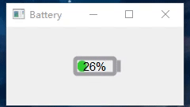
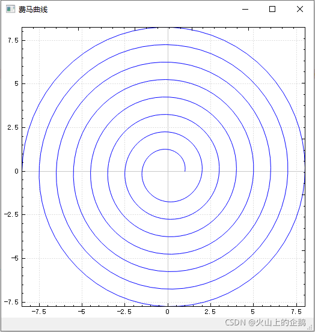
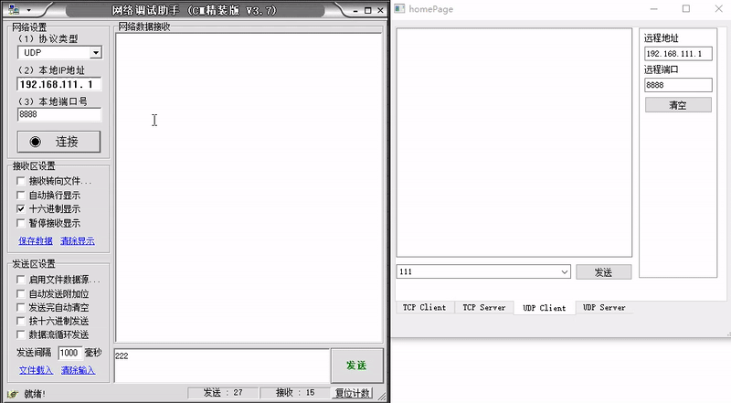
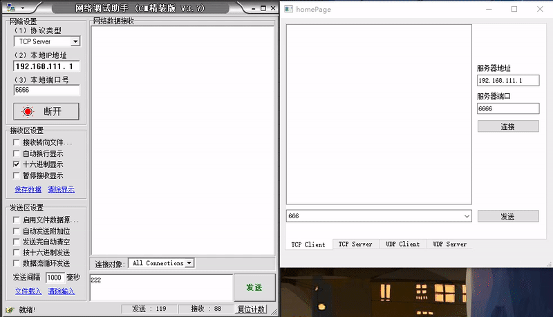
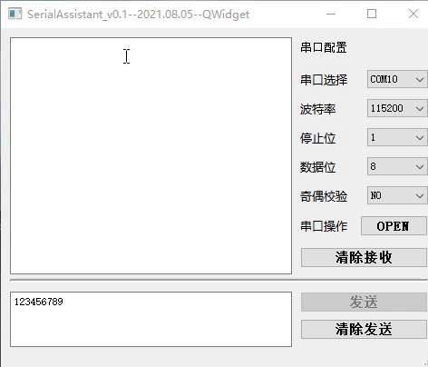

# QWidgetPro

# 项目列表

## 1、综合相关

## 2、控件相关

### 1.  电池控件 Battery  [Windows]

**创建日期**：2021.08.05 ；

**环境：** **QT5.15.2+MSVC2019、QT5.12.6+MSVC2017**：  

概要： Battery 电池控件，使用 QPainter 画板

关键控件/库：  QPainter drawLine drawRoundedRect

博客地址：[https://blog.csdn.net/qq_16504163/article/details/120253549](https://blog.csdn.net/qq_16504163/article/details/120253549)

## 3、工具相关
### 1. 螺旋曲线 FermatSpiral  [Windows]

**创建日期**：2021.10.03 ；

**环境：** **QT5.15.2+MSVC2019、QT5.12.6+MSVC2017**：  

概要：  Qt Widget使用QCustomPlot库实现二维螺旋曲线

关键控件/库：  螺旋曲线、QCustomPlot、费马曲线

博客地址：https://chuhan.blog.csdn.net/article/details/121588733

、

### 2.  网络助手 NetTools  [Windows]

**创建日期**：2021.10.18 ；

**环境：** **QT5.15.2+MSVC2019、QT5.12.6+MSVC2017**：  

概要：  Qt Widget使用QCustomPlot库实现二维螺旋曲线

关键控件/库：  TCP UDP

博客地址：https://chuhan.blog.csdn.net/article/details/120809790
          https://blog.csdn.net/qq_16504163/article/details/120832673

### 3.  串口助手 QSerialAssistant  [Windows]

**创建日期**：2021.10.18 ；

**环境：** **QT5.15.2+MSVC2019、QT5.12.6+MSVC2017**：  

概要：   QSerialAssistant  ，能收发数据，识别串口号，这是一个最基本的版本

关键控件/库： QSerialPort

博客地址：https://blog.csdn.net/qq_16504163/article/details/119395864

### 4.  QtPdfium库实现 PDF   [Windows]

**创建日期**：2024.12.18 ；

**环境：** **QT5.15.2+MSVC2019**：  

概要：  Pdfium是一个由Google开发并开源的PDF渲染引擎

关键控件/库：QtPdfium 

博客地址：https://blog.csdn.net/qq_16504163/article/details/144502382

### 5.  QAxObject 对 Word 替换   [Windows]

**创建日期**：2024.12.18 ；

**环境：** **QT5.15.2+MSVC2019**：  

概要：  QAxObject 是 Qt 提供的一个类

关键控件/库：QAxObject

博客地址：https://blog.csdn.net/qq_16504163/article/details/144525560

## 4、UI相关
## 5、地图类
## 6、视频类

